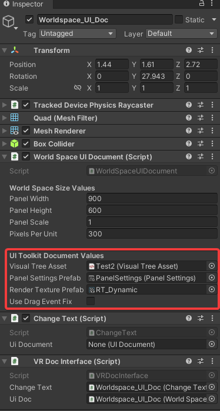
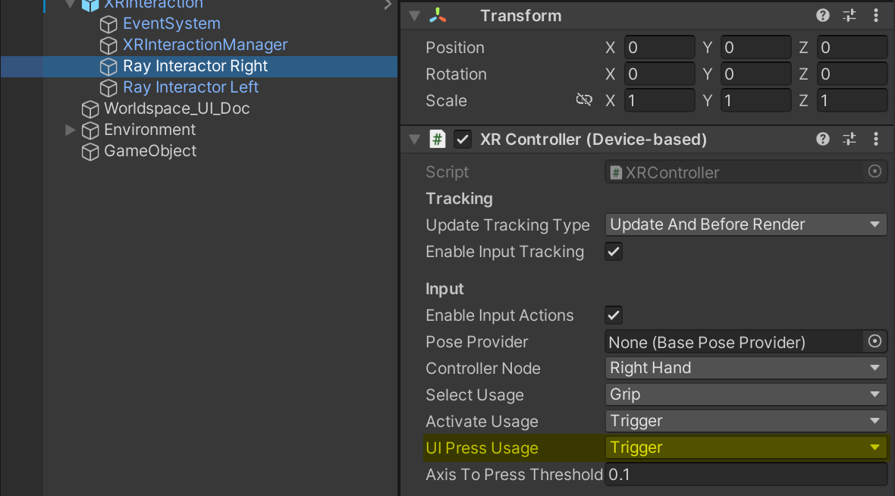
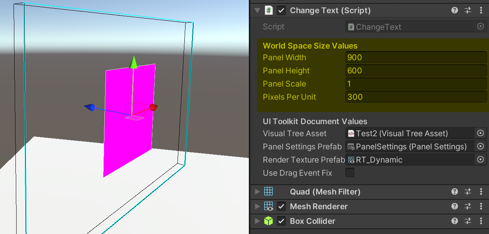

# ReadMe: World Space VR UIDocuments


## Sample Scene: WorldSpace_VR

The following project illustrates how to setup a UXML for Worldspace that's capable of interacting with VR controllers

## Step by step Process:

### UIDocument components:
* Create a UXML Document 
* Create a Panel settings asset 
* Create a Render Texture (This will be used as a prefab, so no need to create multiple render textures)

### VR components
* Create an XR Rig (Any - XRI - Oculus, etc)
* Add the XR Interaction Prefab (Assets/Prefabs/XRInteraction). This contains the Custom EventSystem addition, and the Registered interactors so that the pointer events get communicated properly
	
### In a unity Scene
* Add the WorldSpaceUIDocument to a GameObject. Note that MeshFilter, Renderer and Collider are added automatically
* Reference the created UIDocument components in the UIToolkit Document values subsection



* For adding functionality to an existing UI, suscribing to the OnPanelCreatedEvent should fill the UIDocument component needs, allowing for any uxml document to be used with this system. See provided Example:

```
//ChangeText.cs (Existing 2D functionality for a UI)


public void SetUIDocument(UIdocument doc)
{
}

//VRDocInterface. Suscribes to WorldspaceUIDoc OnPanelBuilt Event, fills Doc reference to exising UI

private void Awake()
{
	_uiDoc.OnPanelBuilt += _changeText.SetupPanel;
}

```


## Notes

* Panel Settings Determines the colour of the background. To get a clear background set the Alpha to any value below 1.0f
* The UI selection button can be changed in the XR Controller Components (XRInteraction/RayInteractor(LR)/XRController -> UI Press Usage)



* Scale does not affect the size of the World Scale Panels. The panel Width/Height and Pixels per unit do. There's a provided gizmo that will show the Runtime Size/Orientation of the panel. (Blue Outline -> Forward face of the UI)



*For Non VR interfaces, the UITextureProjection component can be used instead (See sample Scenes/WorldSpace_FlatScreen). Note that for multiple UIs, multiple panel setting Objects are required, otherwise, inconsistent UI behaviour can happen.


